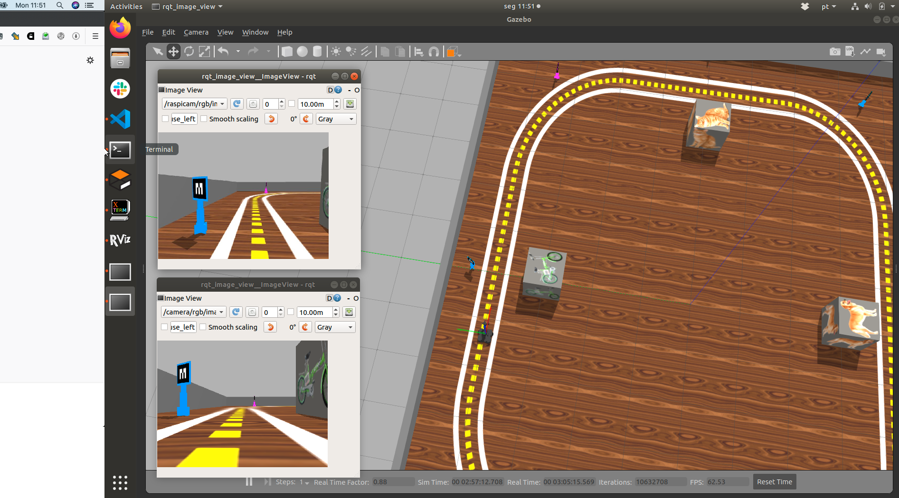
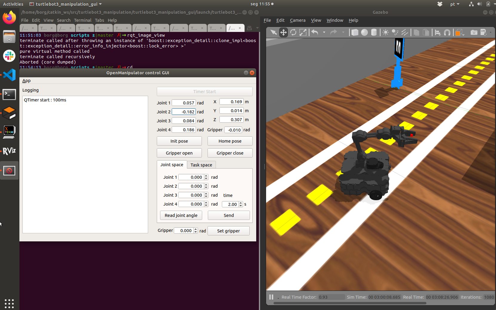

# Projeto 1

Datas:

Deadline 11/05 para primeira entrega. 

Quem na entrega de 11/05 entregar um vídeo com o que já foi completado  e a URL do código ganha prazo até 14/05. 

        Maio 2020
    Su Mo Tu We Th Fr Sa
                    1  2
    3  4  5  6  7  8  9
    10 11 12 13 14 15 16
    17 18 19 20 21 22 23
    24 25 26 27 28 29 30
    31

# Rubrica

C - Ficar na pista, encontrar creeper da cor certa, derrubar e voltar para a pista

B - Pegar um creeper da cor certa, voltar para a pista e deixar na base certa. **Pode usar a inteface manual para controlar a garra** 

A - Pegar creeper da cor e Id certos. Deixar na base certa. Estar bem modularizado 

Cores válidas do creeper: `blue`, `green`, `pink`
Estações válidas: `dog`, `cat`, `bicycle` e `bird`

### Exemplo de objetivo: 

O objetivo abaixo significa "Encontre o creeper azul que tem o ID número 23 e o traga até perto da caixa com o pássaro"

~~~python

    goal = ["blue", 23, "bird"]

~~~

# Como rodar 

Atualizar `my_simulation` 

Atualizar `robot20`  

# Rodar script instala_garra.sh:

O comando abaixo é capaz de executar o comando:

    sudo sh $(rospack find my_simulation)/garra/instala_garra.sh
    

# Rodar cenário:

Para executar o cenário, faça:

    roslaunch my_simulation proj1.launch
 
Existe também uma versão com **pista mais estreita** em que pode ser mais fácil encontrar o ponto de fuga.

    roslaunch my_simulation proj1_estreita.launch

A figura abaixo mostra a pista do projeto. 

</img>

# Rodar exemplo 

Existe um código exemplo que junta 

    rosrun projeto1_base base_proj.py

Este exemplo pode ou não ser usado, conforme seu grupo achar melhor. 

# Usando a garra

Iniciando o módulo de controle da garra:

    roslaunch turtlebot3_manipulation_moveit_config move_group.launch

Para abrir o software para controlar a garra interativamente e aprender os ângulos e posições:

    roslaunch turtlebot3_manipulation_gui turtlebot3_manipulation_gui.launch

O software permite que você especifique o movimento da garra **tanto em ângulos** quando em termos da posição desejada para a ponta da garra.

</img>

Note que até o conceito B você pode oeprar a garra manualmente. Para fazer isso programe seu robô para chegar perto o suficiente do creeper e pedir explicitamente que você o opere. Você vai precisar usar um `raw_input()` no código para **congelar** o terminal enquanto faz a pilotagem. Par

Existem algumas orientações sobre como controlar a garra neste link [https://github.com/arnaldojr/my_simulation/blob/master/garra/Open_manipulator_gui.md](https://github.com/arnaldojr/my_simulation/blob/master/garra/Open_manipulator_gui.md).

Note que você **precisa** ter este projeto em seu `catkin_ws/src` senão a garra fica com um dos lados frouxos. O script `instala_garra.sh` faz o download dele, mas certifique-se. 

    cd ~/catkin_ws/src
    git clone https://github.com/roboticsgroup/roboticsgroup_gazebo_plugins

## Controlando a garra por código

Rodando o software para controlar a garra

Exemplo que controla passando ângulos-objetivo: 

    rosrun my_simulation  open_manipulator.py

Exemplo que controla passando tanto ângulos quanto posições-objetivo. 

    rosrun my_simulation mgpi_position.py 

